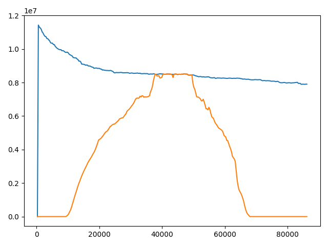
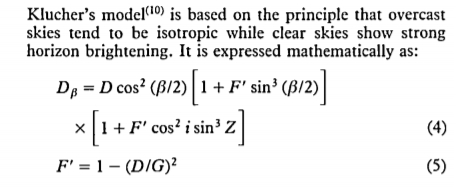

# A renewable energy extention of Cloudsim Simulator #

This fork introduces usage of energy from **photovoltaic farms** to the Cloudsim Simulator.
User can import data from **BSRN database**, define the parameters of a farm and create their own examples.

# Introduced classes #
* *BSRNDataLoader* - parses data from BSRN datasets
* *PhotovoltaicFarm* - contains specifics of a photovoltaic farm
* *RenewableEnergySource* - computes energy based on data from *BSRNDataLoader* and *PhotovoltaicFarm*

# Modified #
* *PowerDataCenter* now keeps track of renewable energy usage

# Running examples #
Some existing examples were changed and now include the usage of renewable energy. They can be found in **cloudsim-examples**.  

Example plot generated from **Dvfs** example, based on station Budapest data (2020-07). Plot illustrates total energy used by data center (blue line) and energy from renewable sources (orange line).

# Equation used to calculate energy from renewable sources #

Equation used to calculate energy from renewable sources was taken from article:  

MUNEER, T. Solar radiation model for Europe. _Building services engineering research and technology_, 1990, 11.4: 153-163.  
  
where: 
* _D&beta;_ is the hourly inclined surface sky-diffuse irradiation [Wh/m2]
* _D_ is the hourly horizontal diffuse irradiation (DHI - Diffuse Horizontal Irradiance) [Wh/m2]
* _&beta;_ is the inclination of sloped surface (sonar panel) [radians]
* _F'_ is the modulating function [dimensionless]
* _i_ is the angle of incidence of sun's rays [radians]
* _Z_ is the zenith angle of sun [radians]
* _G_ is the hourly horizontal global irradiation (GHI - Global Horizontal Irradiance) [Wh/m2]
* also  _G_ = _D_ + _DNI_ * cos(_Z_), where _DNI_ - Direct Normal Irradiance  

This is Klucher's model to be more precise. It is described in:  
KLUCHER, T.M. Solar Energy. _Evaluation of models to predict insolation on tilted surfaces_, 1979, 23.2: 111-114
  
To get final value of  energy from renewable sources _D&beta;_ was multiplied by:  
* single panel area [m2],  
* number of panels,  
* time in which panel was exposed on solar radiation [s],  
* solar's panel yield (given by the ratio : electrical power (in kWp) of one solar panel divided by the area of one panel) [%],  
* performance ratio (constant for losses - range between 0.5 and 0.9, default value = 0.75),  
* efficiency (constant for solar panels - range between 0.18 and 0.23).

 
# Authors #

* [Anna Nosek](https://github.com/Enkelian)
* [Kamil Krzempek](https://github.com/krzempekk)
* [Piotr Kasprzyk](https://github.com/kaspiotr)
* [Wojciech Kosztyła](https://github.com/GabenRulez)

Created as a project for Internet of Things course on [AGH University of Science and Technology](https://www.agh.edu.pl/en/).

